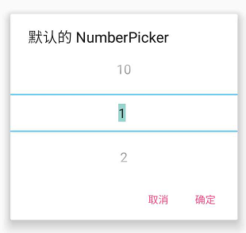
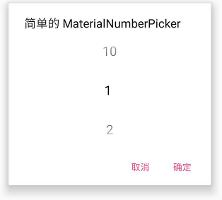
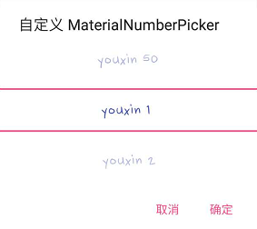

# MaterialNumberPicker


Native NumberPicker | MaterialNumberPicker (default) | MaterialNumberPicker (custom)
---- | ---- | ----
 |  | 


## Usage

Both XML and programmatic instanciations are supported :

```xml
<com.core.youxin.MaterialNumberPicker
        android:layout_width="match_parent"
        android:layout_height="match_parent"
        app:mnpDefaultValue="10"
        app:mnpEditable="false"
        app:mnpFontname="Hand.ttf"
        app:mnpMaxValue="50"
        app:mnpMinValue="1"
        app:mnpSeparatorColor="@color/colorAccent"
        app:mnpTextColor="@color/colorPrimary"
        app:mnpTextSize="16sp"
        app:mnpTextStyle="bold"
        app:mnpWrapped="false" />
```

```kotlin
val numberPicker = MaterialNumberPicker(
        context = this,
        separatorColor = ContextCompat.getColor(this, R.color.colorAccent),
        textColor = ContextCompat.getColor(this, R.color.colorPrimary),
        textSize = resources.getDimensionPixelSize(R.dimen.numberpicker_textsize),
        textStyle = Typeface.BOLD_ITALIC,
        defaultValue = 10,
        minValue = 1,
        maxValue = 50,
        editable = false,
        wrapped = false,
        fontName = "Hand.ttf",
        formatter = NumberPicker.Formatter {
            return@Formatter "Value $it"
        }
)
```

Once you have your number picker, you can present it by itself, or within an alert dialog :

```kotlin
AlertDialog.Builder(this)
        .setTitle(title)
        .setView(numberPicker)
        .setNegativeButton(getString(android.R.string.cancel), null)
        .setPositiveButton(getString(android.R.string.ok), { _, _ ->
            Toast.makeText(this, getString(R.string.picker_value, numberPicker.value), Toast.LENGTH_LONG).show()
        })
        .show()
```


## Pull requests

I welcome and encourage all pull requests. I might not be able to respond as fast as I would want to but I endeavor to be as responsive as possible.

All PR must:

1. Be written in Kotlin
2. Maintain code style
3. Indicate whether it is a enhancement, bug fix or anything else
4. Provide a clear description of what your PR brings
5. Enjoy coding in Kotlin :)
